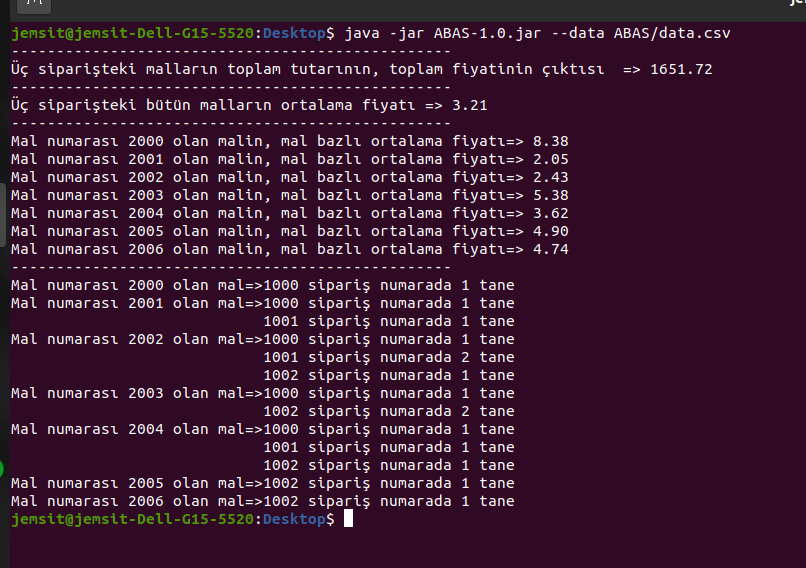

<h1>ABAS Test Case</h1>

 
 So this is my test codes for ABAS test project.  In this codes I tried to use   Decorator pattern also known as Wrapper pattern, but it doesn't work. 
 I copied datas from given file and made a simple csv file (data.csv). I am using that format to get datas.

How does the project works?

<ul>
 <li> clone the project from my github </li>
  <li>you should have installed <b>mvn</b> in your computer, if not install it</li>
  <li>go to project folder and run this command <b>mvn clean package</b></li>
  <li>if everything is ok, run this command  <b>java -jar target/ABAS-1.0.jar --data data.csv </b></li>
</ul>

 you will get something like this:

